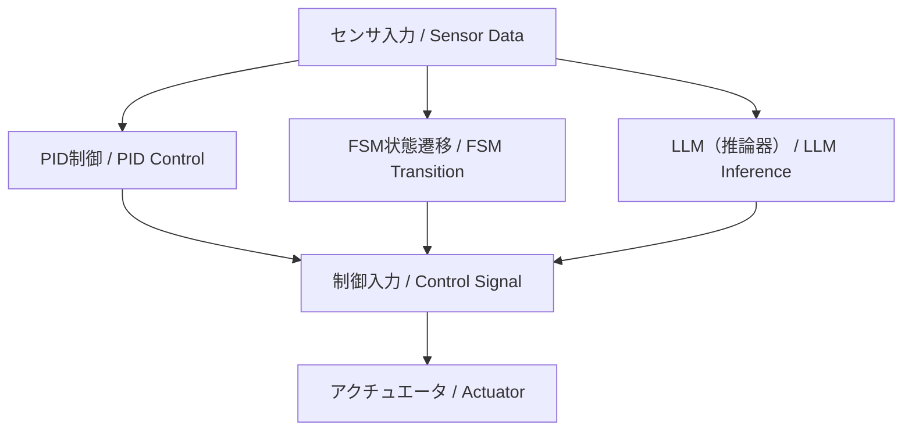

# 🤖 Part 9: ハイブリッド制御とLLM統合  
*Part 9: Hybrid Control with LLM Integration*

---

## 🔗 公式リンク | *Official Links*

| 言語 / Language | GitHub Pages 🌐 | GitHub 💻 |
|-----------------|----------------|-----------|
| 🇯🇵 日本語 / *Japanese* |  |  |

---

本章は **教育・研究用の構想段階** の内容です。  
*This chapter is at a **conceptual / research stage**.*  

- **安定性と応答設計はPID等の制御理論に基づく**ことを前提としています。  
  *Stability and response design rely on classical control theory (e.g., PID).*  
- **FSMやLLMは外層の監督・支援層**であり、直接的な安定性保証の対象には含まれません。  
  *FSM and LLM act as outer supervisory / support layers, not part of the stability-guaranteed control loop.*  
- 運転中の安定性は **PIDループで担保**し、LLM出力は監督下でのみ適用します（LLMは制御ループに直接介入しません）。  
  *Stability is guaranteed by the PID loop; LLM proposals are applied only under supervision and never run inside the real-time loop.*  
- 記述内容はPoCや教育実験の一部であり、今後の検証で変更される可能性があります。  
  *Contents are PoC / educational experiments and may change with further validation.*

---

## 🎯 **学習目標 / Learning Objectives**

- **FSMとPID制御**の連携手法を理解する  
  *Understand how to integrate FSM with PID control*  
- **LLM（ChatGPT等）を制御判断に活用**する手法を学ぶ  
  *Learn how to utilize LLMs (e.g., ChatGPT) for control decision-making*  
- **ルール・対話ベースの制御戦略**を設計できる  
  *Design rule-based and dialogue-based control strategies*  
- **異常対応・目的推論・シナリオ制御**を体験する  
  *Experience exception handling, goal reasoning, and scenario control*  
- **AITL三層構造によるPoC実装**を行う  
  *Implement a PoC of the three-layer AITL architecture*  

---

## 🧩 **章構成（理論教材）/ Chapter Structure (Theory)**

| **ファイル / File** | **内容 / Description** |
|---------------------|-------------------------|
| [01_fsm_pid_llm.md](https://samizo-aitl.github.io/EduController/part09_llm_hybrid/theory/01_fsm_pid_llm.html) | FSM・PID・LLMによる三層制御構造の全体像  *Overview of FSM × PID × LLM architecture* |
| [02_scenario_control.md](https://samizo-aitl.github.io/EduController/part09_llm_hybrid/theory/02_scenario_control.html) | シナリオ制御と状態モード切替の設計  *Scenario-based control and state switching design* |
| [03_exception_handling.md](https://samizo-aitl.github.io/EduController/part09_llm_hybrid/theory/03_exception_handling.html) | LLMを用いた異常検出と例外対応  *LLM-based anomaly detection and exception handling* |
| [04_goal_reasoning.md](https://samizo-aitl.github.io/EduController/part09_llm_hybrid/theory/04_goal_reasoning.html) | 目的推論と対話型制御の導入  *Introduction to goal reasoning and dialogue-based control* |

---

## 🧪 **実装コードとNotebook / Simulation Code & Notebooks**

| **ファイル / File** | **役割 / Function** |
|----------------------|----------------------|
| [fsm_pid_llm_sim.py](https://samizo-aitl.github.io/EduController/part09_llm_hybrid/simulation/fsm_pid_llm_sim.py) | 三層制御統合シミュレーション（FSM × PID × LLM）  *Integrated simulation of FSM × PID × LLM* |
| [goal_reasoning_agent.py](https://samizo-aitl.github.io/EduController/part09_llm_hybrid/simulation/goal_reasoning_agent.py) | LLMベースの目的推論エージェントクラス  *LLM-based goal reasoning agent* |
| [hybrid_control_demo.ipynb](https://samizo-aitl.github.io/EduController/part09_llm_hybrid/notebooks/hybrid_control_demo.ipynb) | Notebook可視化デモ（予定）  *Planned notebook visualization demo* |

> 💡 **特長 / Highlights**  
> - センサ入力、PID制御、FSM遷移、LLM出力を可視化可能  
>   *Visualization of sensor input, PID control, FSM transitions, and LLM output*  
> - 小さなコード改変からシステム全体設計まで段階的に学べる  
>   *Supports progressive learning, from small code changes to full system design*  
> - LLMによる対話応答例や意図推論ログを確認できる  
>   *Check dialogue examples and intent reasoning logs generated by LLMs*  

---

## 📘 **章と実装対応表 / Mapping Between Theory and Code**

| **教材章 / Section** | **内容 / Topic** | **実装ファイル / Script** | **備考 / Notes** |
|------------------|------------------|-----------------------------|------------------|
| 第1章 | FSM・PID・LLM統合  *FSM, PID, and LLM integration* | `fsm_pid_llm_sim.py` | 状態遷移＋PID＋LLM のPoC  *State transitions + PID + LLM PoC* |
| 第2章 | シナリオ制御  *Scenario control* | `fsm_pid_llm_sim.py` | FSMに基づくモード管理  *Mode management based on FSM* |
| 第3章 | 例外処理  *Exception handling* | LLMログ出力部 | 状況判断・切替ロジック  *Context judgment and switching logic* |
| 第4章 | 目的推論制御  *Goal reasoning control* | `goal_reasoning_agent.py` | 自律的意思決定のシミュレーション  *Simulation of autonomous decision-making* |

---

## 🧠 **LLMの最小理屈と利用形態 / Minimal Logic and Usage of LLMs**

- **Attention**：過去情報を動的に重み付け → PIDの固定ゲインと対比して柔軟性を拡張  
  *Attention dynamically weights past information → comparable to extending fixed PID gains*  
- **潜在表現**：内部ベクトルは状態空間近似と見なせる  
  *Latent representations approximate system state space*  
- **確率的出力**：分布として予測 → 行動候補分布に対応  
  *Probabilistic outputs correspond to candidate action distributions*  

**分類 / Types**  
- クラウド型（ChatGPT 等）：設計支援・自然言語インタフェース向き  
  *Cloud-based (e.g., ChatGPT): suitable for design support and natural language interface*  
- 組み込み型（LLaMA, Phi, Mistral 等）：制御ループ内に統合可能  
  *Embedded (e.g., LLaMA, Phi, Mistral): integrable into control loops*  

👉 FSMやPIDと組み合わせることで **安定性＋柔軟性** を両立できる。  
*Combining FSM and PID ensures stability while extending flexibility.*  

---

## 🔗 **三層統合制御アーキテクチャ（概念図） / Three-Layer Integrated Control Architecture**

---

## 📑 **Appendix / Expert Notes**

- [appendix_expert.md](https://samizo-aitl.github.io/EduController/part09_llm_hybrid/appendix_expert.html)  
  *専門家向け補足資料。制御工学とAIの接点をより深掘りした解説。*  
  *Expert supplement: deeper exploration of control engineering × AI integration.*

---

## 🛠 **実行環境ファイル / Execution Environment Files**

- [requirements.txt](https://samizo-aitl.github.io/EduController/part09_llm_hybrid/requirements.txt)  
  *必要最小限の依存関係 / Minimal dependencies*  
- [Makefile](https://samizo-aitl.github.io/EduController/part09_llm_hybrid/Makefile)  
  *シミュレーション・デモ実行用コマンド / Commands for running simulations and demos*  
- [.gitignore](https://samizo-aitl.github.io/EduController/part09_llm_hybrid/.gitignore)  
  *不要ファイルをリポジトリから除外 / Ignore unnecessary files*

---

## 🔜 **今後の展開 / Next Steps**

- ChatGPT API と実機制御の検証  
  *Verification of real-machine control with ChatGPT API*  
- ロボット／GUI／音声対話によるシナリオ制御  
  *Scenario control with robots, GUI, and voice interaction*  
- 強化学習との統合による自己適応制御（Part 10 予定）  
  *Integration with reinforcement learning for self-adaptive control (Planned in Part 10)*  

---

## 🔗 関連章リンク / Related Chapters

- [2.6 FSM導入と状態制御の基本 (Edusemi-v4x)](https://samizo-aitl.github.io/Edusemi-v4x/chapter2_comb_logic/2.6_fsm_intro.html)  
  *Introduction to FSM and state control basics*  
- [第8章 FSM設計 (Edusemi-v4x)](https://samizo-aitl.github.io/Edusemi-v4x/d_chapter8_fsm_design_basics/)  
  *Chapter 8: FSM Design*  
- [01 PID制御の基礎 (EduController)](../part01_classical/theory/01_pid_control.md)  
  *01 Basics of PID Control*  

---

## 📚 **参考資料 / References**

- OpenAI ChatGPT: <https://platform.openai.com/>  
- EduController (GitHub): <https://github.com/Samizo-AITL/EduController>  
- FSM/PID/LLM の統合構想：AITL構想（AITL-H）  
  *Integration concept of FSM/PID/LLM: AITL framework (AITL-H)*  

---

## 👤 **著者・ライセンス | Author & License**

| 📌 項目 / Item | 📄 内容 / Details |
|------|------|
| **著者 / Author** | **三溝 真一**（Shinichi Samizo）  *Shinichi Samizo* |
| **💻 GitHub** |  |

---

## 📄 **ライセンス / License**

  

> 教材・コード・図表の性質に応じたハイブリッドライセンスを採用。  
> *Hybrid licensing based on the nature of the materials, code, and diagrams.*

| 📌 項目 / Item | ライセンス / License | 説明 / Description |
|------|------|------|
| **コード（Code）** | [MIT License](https://opensource.org/licenses/MIT) | 自由に使用・改変・再配布が可能  *Free to use, modify, and redistribute* |
| **教材テキスト（Text materials）** | [CC BY 4.0](https://creativecommons.org/licenses/by/4.0/) | 著者表示必須  *Attribution required* |
| **図表・イラスト（Figures & diagrams）** | [CC BY-NC 4.0](https://creativecommons.org/licenses/by-nc/4.0/) | 非商用利用のみ許可  *Non-commercial use only* |
| **外部引用（External references）** | 元ライセンスに従う  *Follow the original license* | 引用元を明記  *Cite the original source* |

---

**⬅️ [前章 / Previous Chapter](../part08_data_driven/index.md)**  
**[次章 / Next Chapter ➡️➡️](../part10_pendulum/index.md)**  
**🏠 [トップページ / Back to Home](../index.md)**

