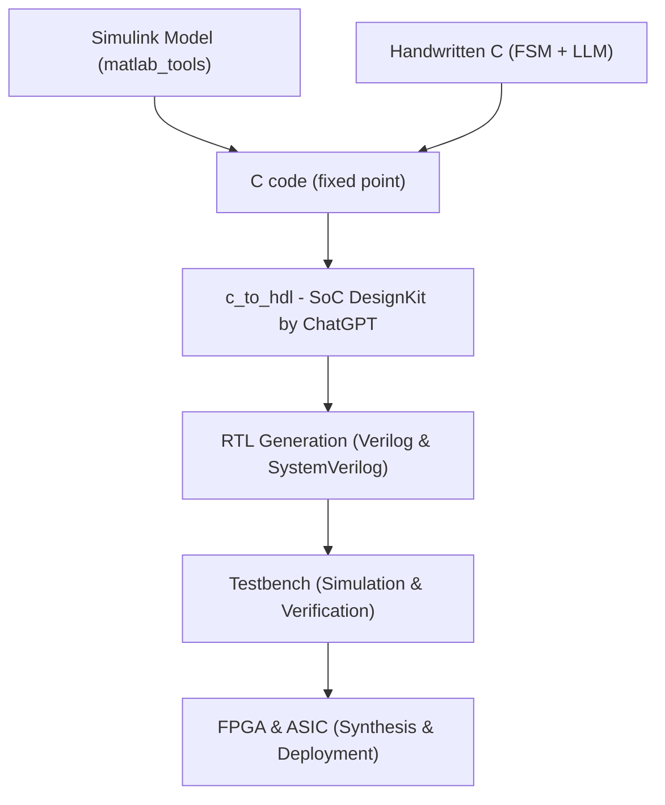

# 🧰 matlab_tools/  
  

💡 **このページは概要です。詳細なコードやモデルは [GitHubリポジトリ](https://github.com/Samizo-AITL/EduController/tree/main/matlab_tools/) を参照してください。**  
ブラウザ上で直接ファイル閲覧・ダウンロード・履歴確認が可能です。  
*This page provides an overview. For detailed code and models, please refer to the [GitHub repository](https://github.com/Samizo-AITL/EduController/tree/main/matlab_tools/).  
You can browse, download, and check file history directly in the browser.*

このディレクトリは、**SimulinkやMATLABコードによる制御設計演習**を支援する補助モジュール群です。  
設計モデルからCコードへの変換や、将来的なVerilog連携（C→HDL）に向けた教材基盤としても活用されます。  
*This directory contains supplementary modules supporting **control design exercises using Simulink and MATLAB code**.  
It also serves as an educational foundation for converting design models into C code and future integration with Verilog (C→HDL).*

---

## 📘 MATLAB / Simulink とは？  
**📘 What are MATLAB / Simulink?**

**MATLAB** は、数値計算・可視化・プログラミングを統合した技術計算環境です。  
**Simulink** は、MATLABと連携して動作するブロック線図ベースの**モデルベースデザインツール**であり、制御系設計・信号処理・システムシミュレーションに広く利用されています。  
**MATLAB** is a technical computing environment integrating numerical analysis, visualization, and programming.  
**Simulink** is a block-diagram-based **model-based design tool** working with MATLAB, widely used for control design, signal processing, and system simulation.

| 概要 | 説明 | Summary | Description |
|------|------|---------|-------------|
| **MATLAB** | スクリプトベースの数値計算環境。行列演算、関数定義、制御工学ツールボックスなどを利用可能。 | **MATLAB** | Script-based numerical environment with matrix operations, function definitions, and control toolboxes. |
| **Simulink** | 連続/離散システムをブロック線図で設計・シミュレーション。GUIベースで制御系構築が可能。 | **Simulink** | Design and simulate continuous/discrete systems via block diagrams; GUI-based control design. |
| **Simulink Coder** | 作成したモデルからC/C++コードを自動生成し、組込みシステムへ実装可能。 | **Simulink Coder** | Automatically generate C/C++ code from models for embedded system implementation. |

> 🎯 本教材は **Simulinkでモデル設計 → Cコード生成 → HDL連携** までの流れを教育目的で支援します。  
> 🎯 This material supports the flow **from model design in Simulink → C code generation → HDL integration**, for educational purposes.

---

## 📁 内容構成 / Contents

| ファイル / ディレクトリ | 内容 / Description |
|------------------------|---------------------|
| [`getting_started.md`](https://samizo-aitl.github.io/EduController/matlab_tools/getting_started.html) | Simulink利用手順（基本操作〜モデル開発） *How to use Simulink (basic operations to model development)* |
| [`model_to_code.md`](https://samizo-aitl.github.io/EduController/matlab_tools/model_to_code.html) | SimulinkモデルからCコード生成する手順 *Steps to generate C code from Simulink models* |
| [`pid_simulink_example.slx`](https://samizo-aitl.github.io/EduController/matlab_tools/pid_simulink_example.slx) | PID制御のSimulinkモデル *Simulink model for PID control* |
| [`state_space_example.slx`](https://samizo-aitl.github.io/EduController/matlab_tools/state_space_example.slx) | 状態空間モデル例（離散系設計） *State-space model example (discrete-time design)* |

---

## 🎯 活用目的 / Usage Purposes

- **EduController** の前段フェーズ（制御モデル設計）での Simulink 活用  
- **Cコード生成後**、[`c_to_hdl/`](https://samizo-aitl.github.io/EduController/SoC_DesignKit_by_ChatGPT/c_to_hdl/) による Verilog 化への導入  
- PID 制御・状態空間制御などの設計検証  
- MATLAB/Simulink 教育から自動化・HDL 連携までの一貫教材化  

- Use Simulink in the **pre-stage of EduController** (control model design).  
- After **C code generation**, introduce Verilog conversion via [`c_to_hdl/`](https://samizo-aitl.github.io/EduController/SoC_DesignKit_by_ChatGPT/c_to_hdl/).  
- Verify designs such as PID control and state-space control.  
- Provide a consistent educational material flow from MATLAB/Simulink training to automation and HDL integration.  

---

## 🧭 利用フロー概要 / Usage Flow Overview

このツール群は **モデル設計から RTL 検証まで** を一気通貫でサポートします。  
Cコードは **2系統**（Simulink 生成 C / 手書き C）から入力でき、最終的に **SoC_DesignKit_by_ChatGPT** 内で HDL 化されます。  

This toolchain supports a **seamless flow from model design to RTL verification**.  
C code can be input from **two sources** (Simulink-generated C / handwritten C), and finally converted into HDL within **SoC_DesignKit_by_ChatGPT**.  

1. **Simulink または 手書き C (matlab_tools/)**  
   - Simulink モデルから **固定小数点 C コード**を生成  
   - または FSM / LLM 制御用の手書き C 関数を用意  
   
   **Simulink or handwritten C (matlab_tools/)**  
   - Generate **fixed-point C code** from Simulink models  
   - Or prepare handwritten C functions for FSM / LLM control  

2. **Cコード → HDL (SoC_DesignKit_by_ChatGPT/c_to_hdl/)**  
   - C コードをテンプレートにマッピングし、**Verilog/SystemVerilog** と **テストベンチ**を自動生成  
   - PID / FSM / LLM 制御を **同一 SoC 内に統合可能**  

   **C code → HDL (SoC_DesignKit_by_ChatGPT/c_to_hdl/)**  
   - Map C code into templates to auto-generate **Verilog/SystemVerilog** and **testbenches**  
   - Integrate PID / FSM / LLM control into the **same SoC**  

3. **シミュレーション & 検証 (SoC_DesignKit_by_ChatGPT/testbench/)**  
   - 自動生成テストベンチで **C と RTL の動作一致**を確認  

   **Simulation & Verification (SoC_DesignKit_by_ChatGPT/testbench/)**  
   - Verify **functional equivalence between C and RTL** with auto-generated testbenches  

4. **合成 & 展開**  
   - FPGA/ASIC フローに統合して実機検証へ  

   **Synthesis & Deployment**  
   - Integrate into FPGA/ASIC flow for real hardware validation  

### 📐 ワークフロー全体図 / Workflow Overview

---

## 🔗 関連リンク / Related Links

| ディレクトリ | 役割 | Directory | Role |
|--------------|------|-----------|------|
| [`c_to_hdl/`](https://samizo-aitl.github.io/EduController/SoC_DesignKit_by_ChatGPT/c_to_hdl/) | Cコードを Verilog HDL に変換（今後の展開） | [`c_to_hdl/`](https://samizo-aitl.github.io/EduController/SoC_DesignKit_by_ChatGPT/c_to_hdl/) | Convert C code to Verilog HDL (future work) |
| [`testbench/`](https://samizo-aitl.github.io/EduController/SoC_DesignKit_by_ChatGPT/testbench/) | HDL 化後のシミュレーション検証 | [`testbench/`](https://samizo-aitl.github.io/EduController/SoC_DesignKit_by_ChatGPT/testbench/) | Simulation verification after HDL conversion |
| [EduController](https://samizo-aitl.github.io/EduController/) | 教材本体との統合演習（Part04, Part05 など） | [EduController](https://samizo-aitl.github.io/EduController/) | Integrated exercises with main materials (e.g., Part04, Part05) |

---

## 🛠️ 今後の拡張予定 / Future Extensions

- Simulink + Embedded Coder による **自動 C コード生成 → HDL 変換支援**  
- `fsm_simulink_example.slx` の追加（**状態遷移可視化設計**）  
- `.m` ファイル形式での **状態空間シミュレーションスクリプト追加**  
- Simulink モデルからの **Python 連携（Simulink Compiler 活用）**  

- Support **automatic C code generation → HDL conversion** with Simulink + Embedded Coder.  
- Add `fsm_simulink_example.slx` (**visualized state transition design**).  
- Add **state-space simulation scripts** in `.m` format.  
- Enable **Python integration** from Simulink models (using Simulink Compiler).  
---

## 📖 参考ドキュメント / References

- [📘 MathWorks Official: Simulink Onramp](https://www.mathworks.com/learn/tutorials/simulink-onramp.html)  
- [📘 Simulink Coder Documentation](https://www.mathworks.com/products/simulink-coder.html)  
- [📘 Control System Toolbox](https://www.mathworks.com/products/control.html)

---

## 👤 **著者・ライセンス | Author & License**

| 📌 項目 / Item | 📄 内容 / Details |
|------|------|
| **著者 / Author** | **三溝 真一**（Shinichi Samizo） |
| **💻 GitHub** |  |

---

## 📄 **ライセンス / License**

> 教材・コード・図表の性質に応じたハイブリッドライセンスを採用  
> *Hybrid licensing based on the nature of the materials, code, and diagrams.*

| 項目 / Item | ライセンス / License | 説明 / Description |
|-------------|----------------------|--------------------|
| **コード（Code）** | [MIT License](https://opensource.org/licenses/MIT) | 自由に使用・改変・再配布可 *Free to use, modify, and redistribute* |
| **教材テキスト（Text materials）** | [CC BY 4.0](https://creativecommons.org/licenses/by/4.0/) | 著者表示必須 *Attribution required* |
| **図表・イラスト（Figures & diagrams）** | [CC BY-NC 4.0](https://creativecommons.org/licenses/by-nc/4.0/) | 非商用利用のみ可 *Non-commercial use only* |
| **外部引用（External references）** | 元ライセンスに従う *Follow the original license* | 引用元を明記 *Cite the original source* |

---

🏠 [トップページに戻る / Back to Top](https://samizo-aitl.github.io/EduController/)

