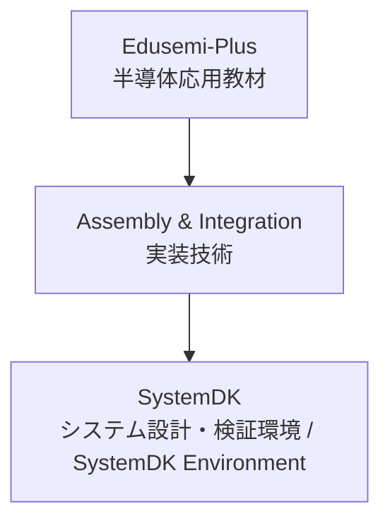

---

# 🧩 Assembly & Integration / 実装技術

---

## 🔗 リンク / Links

| Link | Badge |
|---|---|
| 🌐 View Site |  |
| 📂 View Repo |  |

---

## 🏗 概要 / Overview
Assembly & Integration は、半導体デバイス・受動部品・コネクタ・パッケージを基板上で統合し、システムを構築するための技術領域です。  
*Assembly & Integration is the domain of technologies that integrate semiconductor devices, passives, connectors, and packages on a PCB to build systems.*  

PCB設計、受動部品、コネクタ、実装方式 (SMT, CSP, BGA)、先端パッケージング (2.5D, 3D, Fan-Out)、解析・検証 (SI/PI/熱/EMC) を含みます。  
*It covers PCB design, passives, connectors, mounting methods (SMT, CSP, BGA), advanced packaging (2.5D, 3D, Fan-Out), and analysis/validation (SI/PI/Thermal/EMC).*  

---

## 📂 サブカテゴリ / Subcategories

| サブカテゴリ / Subcategory | 概要 (JP) | Summary (EN) | Links |
|---|---|---|---|
| 📐 PCB | プリント基板 | *Printed Circuit Boards (PCB)* |   |
| 🧩 Passives | 受動部品 (MLCC, 抵抗, インダクタ) | *Passive Components (MLCC, Resistors, Inductors)* |   |
| 🔌 Connectors | コネクタ | *Connectors for high-speed and power delivery* |   |
| ⚙️ Mounting | 実装方式 (SMT, CSP, BGA) | *Mounting technologies such as SMT, CSP, BGA* |   |
| 📦 Advanced Packaging | 先端パッケージング (2.5D, 3D, Fan-Out) | *Advanced packaging such as 2.5D, 3D, Fan-Out, CoWoS, InFO* |   |
| 📊 Analysis & Validation | 実装解析・検証 (SI/PI/熱/EMC) | *Analysis & validation of SI, PI, Thermal, and EMC* |   |

---

## 🔑 キートピック / Key Topics
- PCB設計と基板材料の最適化。  
  *Optimization of PCB design and board materials.*  
- MLCC・抵抗・インダクタなどの受動部品の特性と配置。  
  *Characteristics and placement of passives such as MLCCs, resistors, and inductors.*  
- 高速伝送・電源供給に対応するコネクタ設計。  
  *Connector design for high-speed transmission and power delivery.*  
- 実装方式 (SMT, CSP, BGA) による信頼性・歩留まりへの影響。  
  *Impact of mounting methods (SMT, CSP, BGA) on reliability and yield.*  
- 先端パッケージングによる高帯域・高集積化。  
  *High-bandwidth and high-integration via advanced packaging.*  
- 解析・検証 (SI/PI/熱/EMC) に基づく設計改善。  
  *Design improvements through SI/PI/Thermal/EMC validation.*  

---

## 🌐 教材ポジション / Position

---

## ✅ 学習目標 / Learning Goals
- 実装技術の主要分野を体系的に理解する。  
  *Systematically understand the major domains of assembly and integration.*  
- システム設計における部品・実装・パッケージ・検証の相互関係を把握する。  
  *Grasp the interrelations of components, assembly, packaging, and validation in system design.*  
- SystemDKと連携し、設計・実装・検証の統合プロセスを習得する。  
  *Learn the integrated process of design, assembly, and validation through collaboration with SystemDK.*  

---

## 📑 **関連プロジェクト一覧 / Related Projects**

> Edusemi-v4x の各章と連携する外部／応用プロジェクトを整理。  
> *Organized list of external/applied projects linked with Edusemi-v4x chapters.*

| 📘 プロジェクト / Project | 📖 参照章 / Chapter | 📚 内容概要 / Description |
|---------------------------|---------------------|--------------------------|
| **Edusemi-v4x トップ**       | 全体 / All | 半導体教育教材群のメインプロジェクト。基礎・応用・実践・特別編を含む総合体系。 *Main semiconductor education project covering fundamentals, applications, practice, and special topics.* |
| **チップレットと先端パッケージ**       | 特別編 第2章 / Special Topics Ch.2 | 2.5D/3D実装・TSV・異種集積を用いたチップレット設計と信頼性評価。 *Chiplet design and reliability with 2.5D/3D, TSV, and heterogeneous integration.* |
| **SystemDK制約設計**       | 特別編 第2a章 / Special Topics Ch.2a | 熱・応力・ノイズ制約を設計に反映する System Design Kit (SystemDK) の適用法。 *Applying SystemDK to address thermal, stress, and noise constraints in design.* |
| **FSM×PID×LLM SoC**       | 特別編 第3章 / Special Topics Ch.3 | AITL-H三層制御アーキをベースにした制御SoC実装。 *Control SoC implementation based on AITL-H three-layer architecture.* |
| **OpenLane実装**       | 特別編 第4章 / Special Topics Ch.4 | Sky130 PDKを用いた FSM/PID/LLM の RTL-to-GDSII 実装。 *RTL-to-GDSII implementation of FSM, PID, LLM control with Sky130 PDK.* |
| **DFM設計指針**       | 特別編 第5章 / Special Topics Ch.5 | Sky130 PDKによるレイアウト検証とDFM設計指針。 *Layout verification and DFM guidelines with Sky130 PDK.* |
| **Sky130 実験**       | 実践編 第2章 / Practice Ch.2 | MOS特性評価・BTI/TDBB解析など SkyWater Sky130 PDKを用いた実験。 *MOS evaluation and BTI/TDBB analysis with SkyWater Sky130 PDK.* |
| **Python自動化**       | 実践編 第1章 / Practice Ch.1 | SPICEシミュレーションや解析を自動化するPythonスクリプト群。 *Python scripts for automating SPICE simulations and analysis.* |

---

## 👤 **著者・ライセンス / Author & License**

| **項目 / Item** | **内容 / Details** |
|-----------------|--------------------|
| **著者 / Author** | **三溝 真一**（Shinichi Samizo） |
| **GitHub** |  |
| **ライセンス / License** | MIT License（再配布・改変自由 / Redistribution and modification allowed） |

---

## ⬆️ Back to Edusemi-Plus

| Link | Badge |
|---|---|
| 🌐 Back to Site |  |
| 📂 Back to Repo |  |
