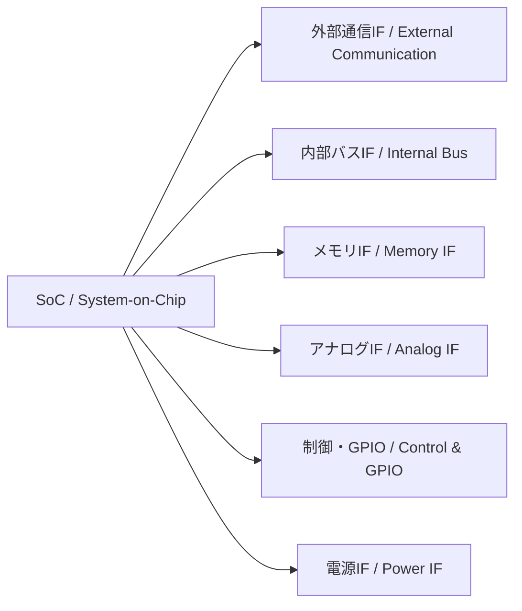

---

# 📘 基礎編 第5a章 : 仕様策定・モジュール選定・インターフェース設計  
**Fundamentals Chapter 5a : Specification Definition, Module Selection, and Interface Design**

---

## 🔗 公式リンク / *Official Links*

| 言語 / Language | GitHub Pages 🌐 | GitHub 💻 |
|-----------------|----------------|-----------|
| 🇯🇵 日本語 / *Japanese* |  |  |

---

## 🔄 前章との接続｜Connection to Previous Chapter

| 🇯🇵 日本語 | 🇺🇸 English |
|-----------|-----------|
| 第4章では、MOSトランジスタ特性とPDKを通じて、製造可能なデバイスレベルの設計基盤を構築しました。 | In Chapter 4, we established a manufacturable device-level design foundation through MOS characteristics and PDKs. |
| 本章では、その基盤を活用して、**SoC設計の上流工程（仕様策定・モジュール選定・IF設計）**に進みます。 | In this chapter, we move to the **upstream stages of SoC design (specification, module selection, interface design)** using that foundation. |

➡️ [📘 **第4章：MOSトランジスタ特性と設計基盤**](../chapter4_mos_characteristics/README.md)  
➡️ [📘 **Chapter 4: MOS Characteristics and Design Infrastructure**](../chapter4_mos_characteristics/README.md) (EN)

---

## 🎯 章のねらい｜Chapter Objectives

| 🇯🇵 日本語 | 🇺🇸 English |
|-----------|-----------|
| - SoC開発の**上流工程**（仕様策定・モジュール選定・インターフェース設計）の全体像を理解する | - Understand the **upstream stages** of SoC development: specification, module selection, and interface design |
| - IF（インターフェース）の種類と選定基準を整理し、設計初期に必要な判断基準を持つ | - Learn the types and selection criteria of interfaces and gain decision-making skills for early design |
| - FPGA PoCやAMS混載設計に接続できる仕様策定の考え方を習得する | - Acquire methods of defining specifications that connect to FPGA PoC and AMS mixed-signal design |

---

## 📚 節構成｜Chapter Structure

| No. | セクション名（日本語） | Section Title (English) | 内容概要 | 関連付録 |
|-----|----------------------|-------------------------|----------|----------|
| [5a.1](5a.1_spec_process.md) | 仕様策定のプロセス | Specification Process | 機能要件・性能要件・制約条件の整理 | [📎 付録：仕様書例](appendix_5a1_spec_example.md) |
| [5a.2](5a.2_module_selection.md) | モジュール選定の基準と事例 | Module Selection Criteria and Examples | CPU/DSP、メモリ、I/O、AMSの選定基準 | — |
| [5a.3](5a.3_interface_design.md) | インターフェース設計と種類 | Interface Design and Types | 外部通信、内部バス、メモリIF、アナログIF、GPIO、電源 | [📎 付録：インターフェース性能一覧](appendix_5a3_interface_speed_map.md) |
| [5a.4](5a.4_linking_poc.md) | PoCへの接続 | Linking to PoC | FPGAでの検証フローと上流設計の関係 | — |

---

## 📝 5a.1 仕様策定のプロセス｜Specification Process

- **機能要件（Functional Requirements）**  
  例：センサ信号処理、データ圧縮、通信プロトコル対応  
- **性能要件（Performance Requirements）**  
  処理速度、スループット、消費電力、応答時間  
- **制約条件（Constraints）**  
  製造ノード、電源電圧範囲、環境条件（温度、湿度）、EMI規格

📎 詳細は → [付録：仕様書例](appendix_5a1_spec_example.md)

---

## 🛠 5a.2 モジュール選定の基準と事例｜Module Selection Criteria and Examples

| モジュール | 選定基準例 | 備考 |
|------------|-----------|------|
| CPUコア | 性能、命令セット互換性、ライセンス形態 | RISC-V, ARM, MIPSなど |
| DSP | 演算精度、MAC性能、消費電力 | 音声・画像処理向け |
| メモリ | 容量、速度、低電力特性 | SRAM, DDR, MRAM |
| AMS | 分解能、SNR、帯域幅 | ADC, DAC, PLL, センサIF |

---

## 🔌 5a.3 インターフェース設計と種類｜Interface Design and Types

| 種類 | 例 | 選定基準 |
|------|---|----------|
| **外部通信IF** | Ethernet, USB, PCIe, CAN, UART, SPI, I²C | データレート、規格準拠、ケーブル長 |
| **内部バスIF** | AMBA (AXI/AHB/APB), Wishbone, TileLink | 帯域幅、レイテンシ、IP互換性 |
| **メモリIF** | DDR4/5, LPDDR, SRAM, MRAM | 容量、速度、低電力性 |
| **アナログIF** | ADC, DAC, LVDS, MIPI CSI/DSI | 分解能、帯域幅、信号品質 |
| **制御/GPIO** | GPIO, PWM, 割り込み線 | 本数、駆動能力、電圧レベル |
| **電源IF** | 電源ピン、PMIC、電圧監視 | 電圧レール数、リップル許容 |

📎 詳細は → [付録：インターフェース性能一覧](appendix_5a3_interface_speed_map.md)

---

### 📊 IF構成例（Mermaid図）

> **💡 GitHub PagesではMermaid図が直接描画されない場合があります。**  
> ソースは[こちら（GitHub表示）](https://github.com/Samizo-AITL/Edusemi-v4x/blob/main/chapter5a_spec_module_if/README.md)から確認できます。

---

## 🔗 5a.4 PoCへの接続｜Linking to PoC

- FPGA上で**選定したIFやモジュールを事前検証**
- AMSやFEM解析が必要な場合は上流段階で仕様に反映
- 量産移行時に**仕様変更を最小化するためのフィードバックループ**を構築

---

## 🔜 次章への導入｜Lead-in to Next Chapter

| 🇯🇵 日本語 | 🇺🇸 English |
|-----------|-----------|
| 第5章では、本章で決定した仕様・モジュール・IFをもとに、RTL設計からGDSIIまでのSoC設計フローに進みます。 | In Chapter 5, we will proceed from the specifications, modules, and IFs decided here to the SoC design flow from RTL to GDSII. |

📎 [📘 **第5章：SoC設計フローとEDAツール**](../chapter5_soc_design_flow/README.md)  
📎 [📘 **Chapter 5: SoC Design Flows and EDA Tools**](../chapter5_soc_design_flow/README.md) (EN)

---

## 👤 **著者・ライセンス | Author & License**

| 📌 項目 / Item | 📄 内容 / Details |
|------|------|
| **著者 / Author** | **三溝 真一**（Shinichi Samizo） |
| **💻 GitHub** |  |
| **📜 ライセンス / License** |  コード / Code: [MIT](https://opensource.org/licenses/MIT) 教材テキスト / Text: [CC BY 4.0](https://creativecommons.org/licenses/by/4.0/) 図表 / Figures: [CC BY-NC 4.0](https://creativecommons.org/licenses/by-nc/4.0/) |

---

## 🔙 戻る｜Back to Top

🏠  
