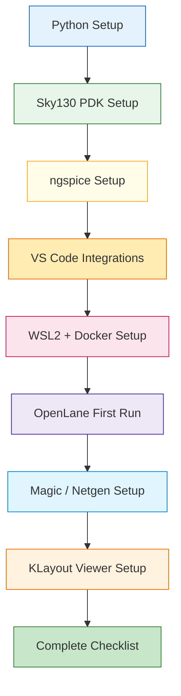

---

# 🛠️ 実践編 第0章：環境構築とツールセットの準備  
**Practical Chapter 0: Environment Setup and Toolchain Preparation**

---

## 🔗 公式リンク / *Official Links*

| 言語 / Language | GitHub Pages 🌐 | GitHub 💻 |
|-----------------|----------------|-----------|
| 🇯🇵 日本語 / *Japanese* | [](https://samizo-aitl.github.io/Edusemi-v4/e_chapter0_environment_setup/) | [](https://github.com/Samizo-AITL/Edusemi-v4x/tree/main/e_chapter0_environment_setup) |

---

## 📘 概要｜*Overview*

本章では、後続の **第1〜第6章の実践内容**（Python 自動化、Sky130 PDK 実験、SPICE 解析、OpenLane 設計）を  
確実に進めるための **完全な開発環境セットアップ手順**を提供します。

This chapter prepares the **full toolchain** necessary for all practical chapters (1–6),  
including Python automation, Sky130 experiments, SPICE simulations, and OpenLane digital design.

---

## 🎯 目的｜*Objectives*

- ✅ Python・VS Code の開発環境構築  
- ✅ Sky130 PDK（volare）と SPICE モデルの導入  
- ✅ OpenLane（Docker + WSL2）の実行環境準備  
- ✅ Magic / Netgen / KLayout の DRC・LVS・GDS ビュー環境  
- ✅ GitHub Pages（教材公開）のビルド環境  

---

## 🧰 必須ツール一覧｜*Required Tools*

| Tool | Purpose |
|------|---------|
| Python 3.10+ | Automation, plotting |
| VS Code | Coding, Jupyter |
| Git / GitHub | Version control |
| ngspice | SPICE simulation |
| Sky130A PDK (volare) | SPICE models / Magic tech |
| Docker Desktop | OpenLane container |
| WSL2 + Ubuntu 22.04 | OpenLane runtime |
| Magic / Netgen | DRC / LVS |
| KLayout | GDS viewer |

---

## 📂 第0章フォルダ構成｜*Folder Structure*

```
e_chapter0_environment_setup/
　├── 00_machine_spec.md 
 ├── 01_python_setup.md
 ├── 02_sky130_pdk_setup.md
 ├── 03_ngspice_setup.md
 ├── 04_vscode_setup.md
 ├── 05_wsl_docker_setup.md
 ├── 06_openlane_first_run.md
 ├── 07_magic_lvs_drc_setup.md
 ├── 08_klayout_viewer_setup.md
 └── 09_complete_environment_checklist.md
```

---

## 🔗 各節へのリンク｜*Links to Each Section*

| 節 / Section | 内容 / Description | リンク |
|-------------|-------------------|--------|
| ✅ 00 Machine Spec | 使用マシン仕様（検証環境） | [📄 Open](00_machine_spec.md) |
| ✅ 01 Python Setup | Python / VS Code 構築 | [📄 Open](01_python_setup.md) |
| ✅ 02 Sky130 PDK Setup | volare・PDK導入 | [📄 Open](02_sky130_pdk_setup.md) |
| ✅ 03 ngspice Setup | SPICE シミュレータ | [📄 Open](03_ngspice_setup.md) |
| ✅ 04 VS Code Setup | 統合開発環境 | [📄 Open](04_vscode_setup.md) |
| ✅ 05 WSL2 + Docker Setup | OpenLane 基盤 | [📄 Open](05_wsl_docker_setup.md) |
| ✅ 06 OpenLane First Run | Verilog→GDS | [📄 Open](06_openlane_first_run.md) |
| ✅ 07 Magic / Netgen Setup | DRC / LVS | [📄 Open](07_magic_lvs_drc_setup.md) |
| ✅ 08 KLayout Viewer Setup | GDS Viewer | [📄 Open](08_klayout_viewer_setup.md) |
| ✅ 09 Total Checklist | 総合確認 | [📄 Open](09_complete_environment_checklist.md) |

---

## 🗺️ 第0章 全体構成図｜*Overall Architecture Diagram*



---

## 👤 **著者・ライセンス | Author & License**

| 📌 項目 / Item | 📄 内容 / Details |
|------|------|
| **著者 / Author** | **三溝 真一**（Shinichi Samizo） |
| **💻 GitHub** | [](https://github.com/Samizo-AITL) |
| **📜 ライセンス / License** | [](https://samizo-aitl.github.io/Edusemi-v4x/#-ライセンス--license)<br>コード / Code: [MIT](https://opensource.org/licenses/MIT)<br>教材テキスト / Text: [CC BY 4.0](https://creativecommons.org/licenses/by/4.0/)<br>図表 / Figures: [CC BY-NC 4.0](https://creativecommons.org/licenses/by-nc/4.0/) |

---

## 🔙 戻る｜Back to Top

🏠 [](../) [](https://github.com/Samizo-AITL/Edusemi-v4x)
