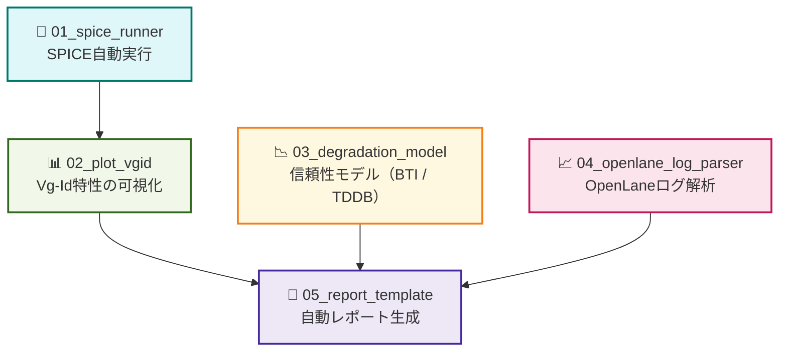

---

# 🛠️ 実践編 第1章：Pythonによる自動化ツール群  
**Practical Chapter 1: Python-Based Automation Tools for Semiconductor Design**

---

## 🔗 公式リンク / *Official Links*

| 言語 / Language | GitHub Pages 🌐 | GitHub 💻 |
|-----------------|----------------|-----------|
| 🇯🇵 日本語 / *Japanese* |  |  |

---

## 📘 概要｜Overview

本章では、Sky130 PDK や OpenLane フローと連携しながら、  
**半導体設計・評価を Python で自動化する実践スクリプト群**を提供します。  

This chapter provides a suite of **Python automation scripts**  
for semiconductor design and evaluation, integrated with **Sky130 PDK** and **OpenLane**.

---

## 🎯 目的｜Objectives

- ✅ SPICEシミュレーションの自動実行と可視化  
 Automated SPICE execution and result visualization  
- ✅ 信頼性モデル（BTI・TDDB）の数値評価とグラフ化  
 BTI/TDDB reliability modeling and plotting  
- ✅ OpenLaneレポートの解析・CSV出力  
 OpenLane report parsing and CSV generation  
- ✅ Pythonによる設計実験の一貫体験  
 Fully automated design experiments via Python  

---

## 📂 フォルダ構成一覧｜Folder Structure

| フォルダ名｜Folder | 内容｜Description |
|--------------------|------------------------------|
| [`01_spice_runner/`](01_spice_runner/README.md) | `ngspice` を `Python` から制御し、パラメータスイープや `Vth` 変化を評価 Run `ngspice` from Python and sweep device parameters |
| [`02_plot_vgid/`](02_plot_vgid/README.md) | SPICE出力ログの読み取りと `Vg–Id` 可視化（`matplotlib`） Parse simulation logs and plot transistor curves |
| [`03_degradation_model/`](03_degradation_model/README.md) | `BTI`・`TDDB` モデルをPythonで数式化しグラフ化 Numerical modeling and visualization of degradation |
| [`04_openlane_log_parser/`](04_openlane_log_parser/README.md) | `OpenLane` のログを解析し、遅延・電力・面積を抽出 Extract key metrics from OpenLane log files |
| [`05_report_template/`](05_report_template/README.md) | 自動レポート出力のテンプレート（Notebook/Markdown） Template for automated design reporting |

---

## 🧰 利用技術と前提環境｜Tools and Requirements

- **Python** 3.8 or later
- 必須ライブラリ｜Required libraries:
  - `matplotlib`, `pandas`, `numpy`, `jupyter`
- 実行環境｜Runtime tools:
  - `ngspice`, `Sky130 PDK`, `OpenLane`（セットアップ済）

---

## 🗺️ 自動化ツール群の構成図（Mermaidフローチャート＋色分け＋GitHubリンク）
 
[📎 GitHubでMermaidフローチャートを見る](https://github.com/Samizo-AITL/Edusemi-v4x/blob/main/e_chapter1_python_automation_tools/README.md)

---

## 📘 関連章リンク｜Related Chapters

- [実践編 第2章：Sky130実験とSPICE特性評価](../e_chapter2_sky130_experiments/README.md)  
 → Sky130デバイスを対象としたSPICEシミュレーション実習  
- [実践編 第3章：OpenLaneによるデジタル設計実習](../e_chapter3_openlane_practice/README.md)  
 → OpenLaneでのP&R・STA結果の評価と接続  

---

## 📌 教材の意義｜Educational Significance

- 🎓 GUIに頼らず **構造的な実験と設計評価** を実践できる  
- 💡 **スクリプト技術 × 設計解析** の実務スキル育成  
- 📈 教育現場でも **再現性の高い自動化環境** を提供可能  

---

## 📦 今後の拡張｜Future Extensions

- `.meas` を使った Vth 自動抽出と劣化モデル接続  
- OpenLane で得たセル特性と信頼性シミュレーションの統合  
- GitHub Actions や CI/CD との連携による自動化パイプライン化  

---

## 👤 **著者・ライセンス | Author & License**

| 📌 項目 / Item | 📄 内容 / Details |
|------|------|
| **著者 / Author** | **三溝 真一**（Shinichi Samizo） |
| **💻 GitHub** |  |
| **📜 ライセンス / License** |  コード / Code: [MIT](https://opensource.org/licenses/MIT) 教材テキスト / Text: [CC BY 4.0](https://creativecommons.org/licenses/by/4.0/) 図表 / Figures: [CC BY-NC 4.0](https://creativecommons.org/licenses/by-nc/4.0/) |

---

## 🔙 戻る｜Back to Top

🏠  
