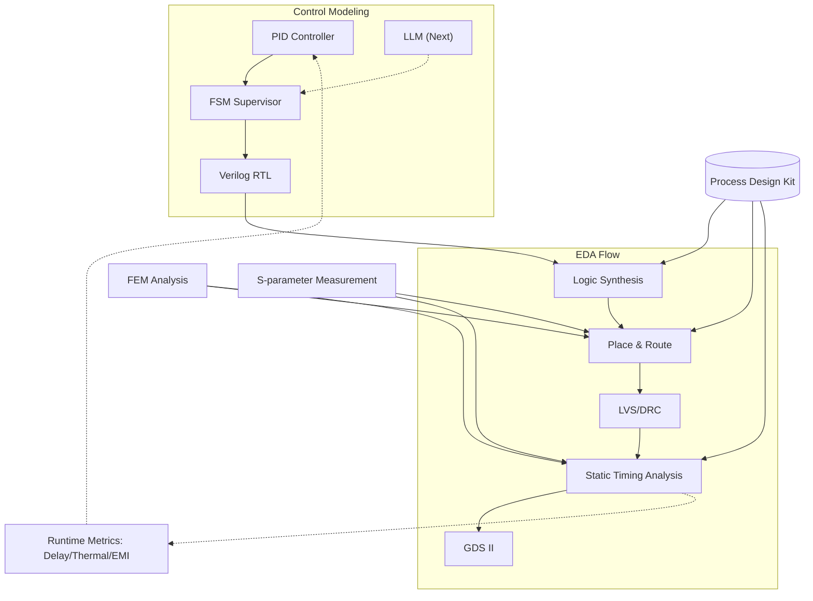
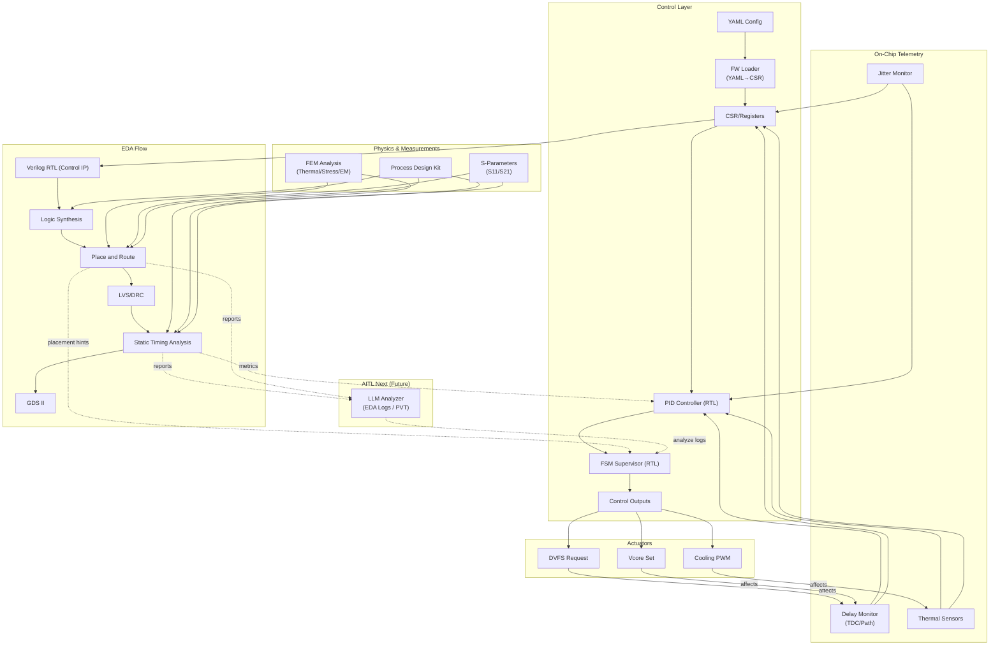
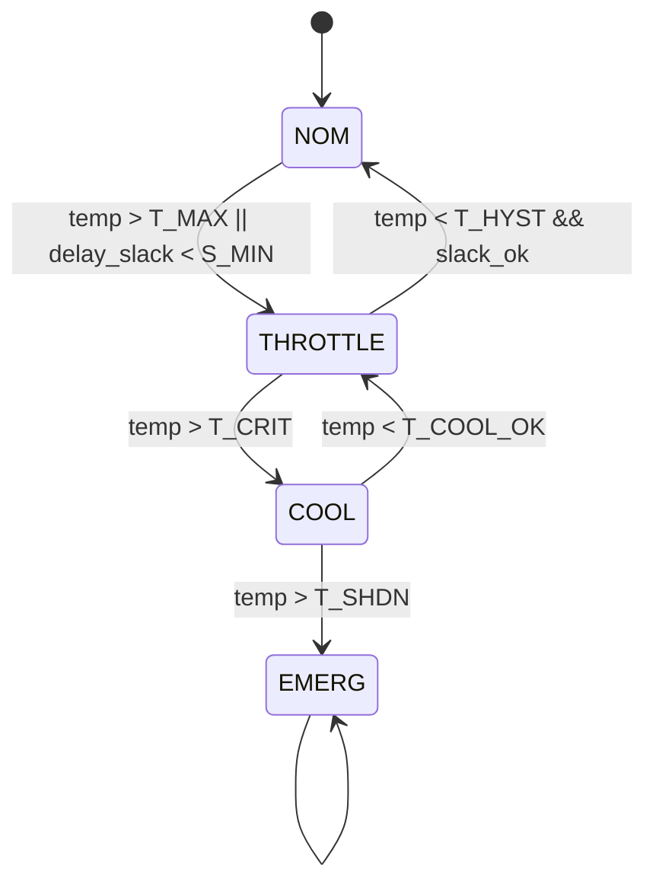
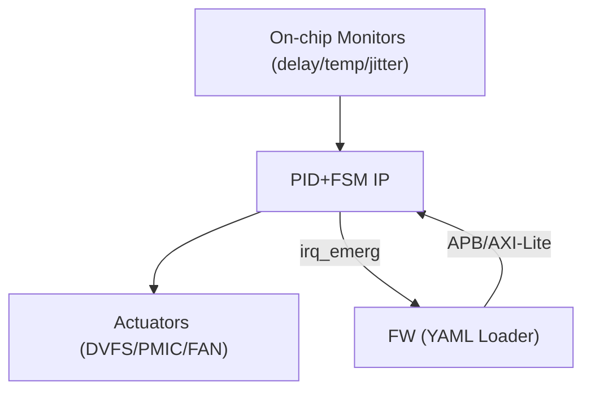

---

# 📕 特別編 第6章：SystemDK with AITL 論文公開 *(Final Chapter)*  
**Special Chapter 6: Research Paper on SystemDK with AITL *(Final Chapter)***

> ⚠️ 本章は **個人研究プロジェクト** に基づくまとめです。  
> 現行実装は **PID＋FSM** が中心であり、**LLM統合はAITL Next（将来拡張）** として位置づけています。  
> 将来、計算性能向上とモデル軽量化によって LLM がリアルタイム制御層に参入するシナリオを描いています。  
>
> ⚠️ *This chapter is based on an **individual research project**.  
> The current implementation focuses on **PID + FSM**, while **LLM integration is positioned as AITL Next (future extension)**.  
> It assumes that with improved computational performance and model lightweighting, LLM will join the real-time control layer in the future.*

---

## 🔗 公式リンク / *Official Links*

| 言語 / Language | GitHub Pages 🌐 | GitHub 💻 |
|-----------------|----------------|-----------|
| 🇯🇵 日本語 / *Japanese* | [](https://samizo-aitl.github.io/Edusemi-v4x/f_chapter6_research/) | [](https://github.com/Samizo-AITL/Edusemi-v4x/tree/main/f_chapter6_research) |

---

## 1. 📝 はじめに / *Introduction & Objective*

**目的**：  
SystemDK with AITL の制御モデル（PID＋FSM＋将来のLLM）を **EDA設計フローに統合**し、サブ2nm世代で深刻化する変動・劣化を **実時間補償** する方法を提示する。  

*Objective:  
To integrate the SystemDK with AITL control model (PID + FSM + future LLM) into the **EDA design flow**, providing **real-time compensation** for variations and degradations critical at sub-2nm nodes.*  

---

### ❌ 従来DTCOの課題 / *Limitations of Conventional DTCO*

- **RC遅延変動**  
  配線スケーリングで **STAが不安定化**  
  *RC delay variation destabilizes STA*

- **熱結合**  
  3D積層で **温度上昇、P&R制約逸脱**  
  *Thermal coupling from 3D stacking violates P&R constraints*

- **EMI/EMC変動**  
  高速伝送で **ジッタがSI/EMC解析に影響**  
  *EMI/EMC variations induce jitter, affecting SI/EMC analysis*

- **信頼性低下**  
  **応力やVthシフト** がPDK反映困難  
  *Stress and Vth shifts poorly reflected in PDK models*

---

### ✅ 提案アプローチ / *Proposed Approach*
1. **PID**：リアルタイム安定化制御  
   *Real-time stabilization with PID*  
2. **FSM**：モード監督と安全制御  
   *Supervisory control and safety enforcement with FSM*  
3. **EDAフロー統合**：RTL化した制御ロジックを Synth → P&R → STA → GDS II に直結  
   *Integration into EDA flow (RTL → Synth → P&R → STA → GDS II)*  
4. **AITL Next (LLM)**：EDAログ解析と将来のリアルタイム適応  
   *EDA log analysis and future real-time adaptation with LLM*  

---

## 2. ⚙️ 提案フレームワーク / *Proposed Framework*

### 現行実装（AITL Base） / *Current Implementation (AITL Base)*
- **PID**：遅延・温度・電圧変動のリアルタイム補償  
  *Real-time compensation of delay, temperature, and voltage variations*  
- **FSM**：モード遷移・安全監督  
  *Supervisory control of modes and safety limits*  

### 将来拡張（AITL Next） / *Future Extension (AITL Next)*
- **LLM**：EDAログ解析によるゲイン再設計・FSMルール更新  
  *LLM for gain redesign and FSM rule updates via EDA log analysis*  
- **役割**：EDAフィードバックを利用し将来的にリアルタイム制御層に参入  
  *Role: Enter real-time control layer using EDA feedback in the future*  

---

### 📊 EDA統合図 / *EDA Integration Flow*



---

### 🗺️ 総合システム図 / *System Overview*

下図は、本章で扱う **制御層（PID＋FSM）—EDAフロー—物理解析（FEM/Sパラ）—テレメトリ—アクチュエータ—AITL Next** の**全体接続**を示す。  
*The diagram aggregates connections across the control layer (PID+FSM), EDA flow, physics (FEM/S-parameters), telemetry, actuators, and AITL Next.*



---

## 3. 🧮 数式モデルとEDA対応 / *Analytical Models and EDA Mapping*

| モデル / Model | 数式 / Equation | EDA対応 / *EDA Mapping* |
|----------------|-----------------|-------------------------|
| **RC遅延**<br>*RC Delay* | $$t_{pd}(T, \sigma, f) = R_0 (1+\alpha_T (T-T_0)+\alpha_\sigma \sigma)C(f)+\Delta_{EMI}(f)$$ | STAでのパス遅延制約<br>*STA path delay constraints* |
| **熱結合**<br>*Thermal Coupling* | $$C_{th}\frac{dT}{dt} + \frac{T-T_{amb}}{R_{th}} = P_{chip}(t)$$ | P&R配置温度制約<br>*P&R thermal placement constraints* |
| **Vthシフト**<br>*Vth Shift* | $$\Delta V_{th}(\sigma)=\kappa\sigma$$ | PDK/SPICEパラメータ補正<br>*PDK & SPICE updates* |
| **EMI注入**<br>*EMI Injection* | $$v_{emi}(t)=A\sin(2\pi f_{emi}t)$$ | SI/EMCクロックジッタ制約<br>*SI/EMC jitter constraints* |

---

## 4. 🔬 シミュレーション結果とEDAでの意味 / *Simulation Results with EDA Implications*

### 4.1 RC遅延補償 / *RC Delay Compensation*  


- **制御なし**：大きなばらつき → STAクロージャ困難  
  *Uncontrolled: large variation → STA closure difficult*  
- **PID**：±20%に収束 → STAパス余裕改善  
  *PID: converges within ±20% → improves STA path margin*  
- **PID＋FSM**：±10%以内 → STAスラック安定化  
  *PID+FSM: within ±10% → stabilizes STA slack*  

---

### 4.2 熱応答制御 / *Thermal Response Control*  


- **制御なし**：+12Kオーバーシュート → P&R制約逸脱  
  *Uncontrolled: +12K overshoot → violates P&R thermal constraints*  
- **PID**：+4K → 設計範囲内  
  *PID: +4K rise → within design range*  
- **PID＋FSM**：+2K以下 → 3D-IC設計制約に適合  
  *PID+FSM: ≤+2K → fits 3D-IC thermal design constraints*  

---

### 4.3 EMIジッタ抑制 / *EMI Jitter Suppression*  


- **制御なし**：100ps → EMC不合格  
  *Uncontrolled: 100ps jitter → EMC test failed*  
- **PID**：20ps → 一部合格  
  *PID: ~20ps → partial compliance*  
- **PID＋FSM**：10ps → EMC設計規格適合  
  *PID+FSM: ~10ps → meets EMC design standards*
  
---

### 4.4 総合比較表 / *Summary Table*

| 指標 / Metric | 制御なし / Uncontrolled | PIDのみ / PID only | PID＋FSM | LLM Next (理想値 / Ideal) | EDAでの意味 / *EDA Implication* |
|---------------|-------------------------|--------------------|-----------|--------------------------|---------------------------------|
| **RC Delay Variation** | 1.0 (norm.) | 0.2 | 0.15 | ≪0.1 | STAタイミング収束性 / *STA closure* |
| **Thermal Rise ΔT** | +12 K | +4 K | +2 K | ≪1 K | P&R温度制約 / *P&R thermal constraint* |
| **EMI Jitter** | 100 ps | 20 ps | 10 ps | ≪5 ps | SI/EMC適合性 / *SI/EMC compliance* |

---

### 4.5 FEM解析 / *FEM Analysis*


- **熱分布 / Thermal distribution**  
  - 制御なし：ホットスポット 120℃超え → 設計制約逸脱  
    *Uncontrolled: hotspot exceeds 120 °C → violates thermal constraints*  
  - PID制御：100℃程度 → 許容範囲  
    *PID: ~100 °C → within acceptable range*  
  - PID＋FSM制御：90℃以下 → P&R温度制約に適合  
    *PID+FSM: ≤90 °C → fits P&R thermal constraints*  


- **応力分布 / Stress distribution**  
  - TSV近傍で応力集中 → Vthシフト 40 mV  
    *Stress concentration near TSV → Vth shift ~40 mV*  
  - PID制御：20 mVに緩和  
    *PID: reduced to ~20 mV*  
  - PID＋FSM制御：10 mV未満に抑制 → PDK補正可能範囲  
    *PID+FSM: <10 mV → within PDK correction range*  

---

### 4.6 Sパラ解析 / *S-parameter Analysis*


**条件 / Conditions**  
- 周波数帯域: 1–10 GHz  
- 伝送路: 10 mm 配線チャネル, 50Ω終端  

**結果 / Results**  

| 周波数 / Freq (GHz) | **S11 (dB)** Uncontrolled | **S21 (dB)** Uncontrolled | **S11 (dB)** PID | **S21 (dB)** PID | **S11 (dB)** PID+FSM | **S21 (dB)** PID+FSM |
|---------------------|----------------------------|----------------------------|------------------|------------------|----------------------|----------------------|
| **1.0** | -12 | -1.0 | -15 | -0.5 | -18 | -0.2 |
| **5.0** | -6  | -6.5 | -10 | -4.0 | -15 | -2.0 |
| **10.0**| -3  | -12  | -7  | -8.0 | -12 | -5.0 |

- **制御なし**：高周波で反射悪化・減衰増大 → 通信不可  
  *Uncontrolled: severe reflection & attenuation at high freq → transmission failure*  
- **PID**：ロス緩和・反射抑制 → 一部改善  
  *PID: mitigated loss & reflection → partial improvement*  
- **PID＋FSM**：ロス大幅低減・反射抑制 → SI/EMC適合  
  *PID+FSM: strong loss reduction & reflection suppression → SI/EMC compliant*
  
---

## 5. 💻 実装PoC / *Implementation PoC*

### 5.1 PID RTL実装 / *PID RTL Implementation*

**ねらい**：固定小数点で軽量・合成可能なPID。飽和・アンチワインドアップ・出力レート制限を内蔵。  
*Goal: Lightweight, synthesizable fixed-point PID with saturation, anti-windup, and slew-rate limiting.*

**固定小数点の取り決め（例） / *Fixed-point convention (example)*  
- データ幅 **W=16**, 小数部 **FRAC=8**（Q7.8）  
  *Width W=16, fractional bits FRAC=8 (Q7.8)*  
- すべて符号付き2の補数  
  *All signed two’s complement.*

```verilog
// pid_ctrl.v : Synthesizable fixed-point PID with anti-windup & slew-limit
module pid_ctrl #(
  parameter int W    = 16,   // data width
  parameter int FRAC = 8,    // fractional bits (Q format)
  parameter int UMAX = 16'sh7FFF, // max |u| (after scaling)
  parameter int SLEW = 16'sh0100   // max delta u per cycle (Q)
)(
  input  logic                   clk,
  input  logic                   rst_n,
  // 誤差 e[k] = 目標 - 実測 / *error = setpoint - measurement*
  input  logic signed [W-1:0]    e,
  // ゲイン / *gains*
  input  logic signed [W-1:0]    Kp, Ki, Kd,
  // 出力 u[k] / *control output*
  output logic signed [W-1:0]    u_out
);
  // 内部レジスタ
  logic signed [W-1:0] i_acc, e_prev, de;
  logic signed [W-1:0] p_term, i_term, d_term;
  logic signed [W-1:0] u_raw, u_sat, u_next;
  logic signed [W-1:0] slew_delta;

  // 差分・PI積分
  always_ff @(posedge clk or negedge rst_n) begin
    if (!rst_n) begin
      e_prev <= '0;
      de     <= '0;
      i_acc  <= '0;
    end else begin
      de     <= e - e_prev;
      e_prev <= e;
      // アンチワインドアップ：出力が飽和時は積分をフリーズ / *freeze I when saturated*
      if (u_raw != u_sat) i_acc <= i_acc; else i_acc <= i_acc + e;
    end
  end

  // 固定小数点の積算（>>> FRAC でスケール回復） / *fixed-point multiply*
  always_comb begin
    p_term = (Kp * e)    >>> FRAC;
    i_term = (Ki * i_acc)>>> FRAC;
    d_term = (Kd * de)   >>> FRAC;
    u_raw  = p_term + i_term + d_term;
  end

  // 飽和 / *saturation*
  always_comb begin
    if (u_raw >  $signed(UMAX)) u_sat =  $signed(UMAX);
    else if (u_raw < -$signed(UMAX)) u_sat = -$signed(UMAX);
    else u_sat = u_raw;
  end

  // スルーレート制限 / *slew-rate limiting*
  always_comb begin
    slew_delta = u_sat - u_out;
    if (slew_delta >  $signed(SLEW)) u_next = u_out + $signed(SLEW);
    else if (slew_delta < -$signed(SLEW)) u_next = u_out - $signed(SLEW);
    else u_next = u_sat;
  end

  always_ff @(posedge clk or negedge rst_n) begin
    if (!rst_n) u_out <= '0;
    else        u_out <= u_next;
  end
endmodule
```

**合成ノート / *Synthesis notes***  
- 乗算器は **DSPブロック** にマップ（FPGA）／**Booth 乗算器**（ASIC）推奨。  
  *Map to DSP slices (FPGA) or Booth multipliers (ASIC).*  
- タイミング目標例：**500 MHz @ 5 nm** を想定しパイプライン段の挿入を許容。  
  *Allow optional pipelining to hit 500 MHz @ 5 nm (example target).*

**簡易テストベンチ（抜粋） / *Mini testbench (excerpt)***  
```verilog
initial begin
  rst_n=0; #(20); rst_n=1;
  Kp=16'sd256; Ki=16'sd16; Kd=16'sd64; // 1.0, 0.0625, 0.25 in Q8
  repeat(1000) begin
    // ステップ誤差の模擬 / *step error*
    e <= (time<5000) ? 16'sd256 : 16'sd0;
    @(posedge clk);
  end
end
```

---

### 5.2 FSM遷移図と仕様 / *FSM Transitions & Spec*

**状態と役割 / *States & roles***  

| **State** | 日本語説明 | *English* | 主なアクション / *Actions* |
|---|---|---|---|
| **NOM** | 通常運転 | *Nominal* | PID有効、平常制限 |
| **THROTTLE** | 温度・遅延が閾値超過 | *Throttle* | 周波数/電圧を緩やかに下げる |
| **COOL** | クリティカル手前の冷却 | *Cool* | ファン/冷却強化、DVFS強 |
| **EMERG** | 緊急停止レベル | *Emergency* | 出力遮断、リセット要求 |

*The FSM supervises PID behavior and enforces safety envelopes.*

**遷移図 / *Transition diagram***  


**出力信号 / *Outputs***  
- `dvfs_level[2:0]`：0=HighPerf, 1=Nom, 2=Throt, 3=Cool  
  *DVFS performance bin.*  
- `cooler_pwm[7:0]`：冷却制御  
  *Cooling PWM.*  
- `trip_emerg`：緊急停止要求  
  *Emergency trip.*

---

### 5.3 YAML設定 & CSRマップ / *YAML Config & CSR Map*

**YAMLスキーマ（抜粋） / *Schema (excerpt)***  
```yaml
targets:
  delay_ps: 1200    # 目標遅延 [ps] / target path delay
  temp_C:   80      # 目標温度 [°C] / target temperature
limits:
  T_MAX:   90       # throttle開始
  T_CRIT:  95       # cool移行
  T_SHDN: 105       # emergency
  S_MIN:   50       # slack最小 [ps]
pid:
  Kp: 0.80
  Ki: 0.05
  Kd: 0.10
actuator_bounds:
  freq_mhz: [800, 3200]
  vcore_mv: [700, 1100]
  fan_pwm:  [0, 255]
telemetry:
  avg_window: 64    # フィルタ窓 / moving average window
```

**レジスタ（APB/AXI-Lite想定） / *Registers (APB/AXI-Lite)***  

| Addr | **名前** | *Name* | 説明 / *Description* |
|---:|---|---|---|
| 0x00 | `CTRL` | *Control* | bit0: enable, bit1: reset_iacc |
| 0x04 | `KP` | *Kp (Q format)* | PID比例ゲイン |
| 0x08 | `KI` | *Ki (Q)* | PID積分ゲイン |
| 0x0C | `KD` | *Kd (Q)* | PID微分ゲイン |
| 0x10 | `T_MAX` | *Throttle threshold* | 温度上限開始 |
| 0x14 | `T_CRIT` | *Critical threshold* | 冷却強化 |
| 0x18 | `T_SHDN` | *Shutdown threshold* | 緊急停止 |
| 0x1C | `S_MIN` | *Min slack* | STAスラック下限 |
| 0x20 | `U_MAX` | *Output saturation* | 飽和上限 |
| 0x24 | `SLEW` | *Slew rate* | 1cycleの最大変化 |
| 0x28 | `STATUS` | *Status* | [3:0] state, [8] emerg, [9] slack_ok |

*CSR values are Q-format where applicable and map one-to-one from YAML at boot or via firmware.*

**初期化フロー / *Init flow***  
1. ブート時にYAML→CSRへロード（ファーム or ROM）。  
   *Load YAML→CSRs at boot (FW/ROM).*  
2. `enable=1` で制御開始。  
   *Assert `enable` to start control.*  
3. テレメトリ平均窓 `avg_window` をSoC内フィルタに設定。  
   *Program moving-average window for telemetry filters.*

---

### 5.4 トップレベル接続 / *Top-level Hook-up*

**I/F概要 / *Interfaces***  
- **モニタ入力**：`meas_delay_ps`, `temp_C`, `emi_jitter_ps`  
  *Monitored signals from on-chip monitors (TDC, thermal diodes, PLL jitter).*  
- **アクチュエータ出力**：`dvfs_req`, `vcore_set`, `fan_pwm`  
  *Actuators to PLL/PMIC/cooling.*  
- **バス**：APB/AXI-Lite CSR、割り込み `irq_emerg`  
  *CSRs via APB/AXI-Lite; emergency IRQ.*



**EDA連携メモ / *EDA integration notes***  
- STA：`meas_delay_ps` 生成経路には **MCMM** セットを適用。  
  *Apply MCMM views to monitor paths.*  
- P&R：温度分布の高いブロック近傍に **センサー/アクチュエータ** を配置。  
  *Place sensors/actuators near thermal hotspots.*  
- DFT：PID内部レジスタは **スキャン** 対応。  
  *Make internal regs scannable for DFT.*

---

## 6. 🚀 今後の展望 / *Future Work*

- **AITL Base**：PID＋FSM による安定制御の確立とEDAフローへのPoC統合  
  *Establish PID+FSM stability and PoC integration into EDA flows*  
- **AITL Next**：軽量化LLMによるEDA解析・制御補償再設計  
  *Lightweight LLM for EDA log analysis and adaptive compensation redesign*  
- **産業応用**：実チップ試作とEDAツール連携によるAI駆動DTCOの実証  
  *Prototype chips and EDA tool collaboration for AI-driven DTCO*  

---

## 7. 📄 論文・関連リンク / *Downloads & Related Links*
- 📑 [Main Paper (PDF)](systemdk_aitl2025.pdf)  

🔗 **Related Chapters**  
- [特別編 第2a章：SystemDK設計対応](../f_chapter2a_systemdk/)  
- [特別編 第3章：AITL-H統合制御SoC実装](../f_chapter3_socsystem/)  
- [特別編 第4章：OpenLane実装](../f_chapter4_openlane/)  
- [特別編 第5章：PDKとDFM設計指針](../f_chapter5_dfm/)  

---

## 8. 👤 著者・ライセンス / *Author & License*

| 📌 Item | 📄 Details |
|------|------|
| **Author** | **三溝 真一 / Shinichi Samizo** |
| **💻 GitHub** | [](https://github.com/Samizo-AITL) |
| **📜 License** | [](https://samizo-aitl.github.io/Edusemi-v4x/#-ライセンス--license)<br>Code: [MIT](https://opensource.org/licenses/MIT)<br>Text: [CC BY 4.0](https://creativecommons.org/licenses/by/4.0/)<br>Figures: [CC BY-NC 4.0](https://creativecommons.org/licenses/by-nc/4.0/) |

---

## 🔙 戻る / *Back to Top*
🏠 [](../)  
📂 [](https://github.com/Samizo-AITL/Edusemi-v4x)

