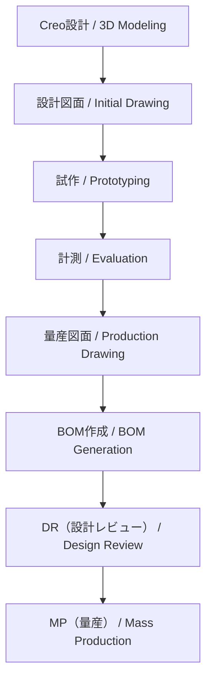

---

# 🏭 **production_process - 設計から量産立上げ | Design to Mass Production**

**設計から量産立上げまでの一貫プロセス教材**  
**Integrated Process Training from Design to Mass Production** 

---

## 🔗 公式リンク | Official Links 

| 言語 / Language | GitHub Pages 🌐 | GitHub 💻 |
|-----------------|----------------|-----------|
| 🇯🇵 Japanese |  |  |

---

## 📘 **概要 | Overview**

本セクションでは、**Creoを用いた設計初期段階から、量産図面作成、BOM（部品表）生成、設計レビュー（DR）を経て、MP（Mass Production：量産）に至るまでの一連の実践プロセス**を学びます。    
設計意図の明確化、試作・計測結果の反映、公差・材料指定、構成管理までを網羅し、実務に近い設計フローを体験できます。   

This module provides **hands-on training in the complete development cycle**—from initial 3D CAD modeling using Creo, to creating production-ready drawings, generating BOMs, conducting design reviews, and preparing for mass production.  
It emphasizes **design intent, prototyping feedback, tolerance/material specification, and configuration management** for practical application.   

🔗 [💻 View Repo](https://github.com/Samizo-AITL/EduMecha/tree/main/08_production_process)

---

## 🔁 **設計プロセスフロー | Design-to-MP Workflow**

---

## 🔗 **実務フロー拡張版 | Practical Workflow (Extended)**

標準フローに加え、実際の現場で行われる  
**環境データ積み上げ判定・コスト積み上げ・輸出管理(該非判定/ECCN/HSコード/用途説明書)** を含んだ詳細フローを整理しています。  

👉 [📄 実務フロー詳細を見る](./production_process_flow.md)

---

## 📂 **ディレクトリ構成 | Directory Structure**

| 📁 フォルダ | 📘 内容 / Description |
|-------------|-------------------------|
| `01_creo_modeling/` | 初期モデリング例（パラメトリック設計） Initial parametric modeling |
| `02_drawing_creation/` | 設計図面（設計意図入り） Initial design drawings |
| `03_prototyping/` | 試作とモデル出力（STL等） Prototyping and STL export |
| `04_measurement_report/` | 計測結果と改善点レポート Measurement results & improvement logs |
| `05_production_drawing/` | 量産用製図（材料・公差含む） Production drawings with tolerances & materials |
| `06_bom_generation/` | BOMテンプレートと記入例 BOM template and sample |
| `07_design_review/` | DR資料（チェックリスト・議事録） Design review docs & checklists |
| `08_mp_guideline/` | 量産移行ガイドライン（工程/構成管理） Guidelines for mass production |

---

## 🧑‍🏫 **学習目標 | Learning Objectives**

- ✅ Creoによるパラメトリック設計と図面出力  
  *Parametric design & drawing creation in Creo*  
- ✅ 試作→評価→設計反映のフィードバックループ構築  
  *Build feedback loop: prototype → evaluate → redesign*  
- ✅ 材料・公差・検査基準を含む量産図面作成  
  *Create production-ready drawings with tolerances & materials*  
- ✅ Excel形式のBOMの構築と構成管理  
  *Build and manage Excel-based BOMs*  
- ✅ チェックリストに基づく設計レビュー実施  
  *Conduct structured design reviews*  
- ✅ SCM・QA部門との連携を想定した量産準備  
  *Prepare for MP in collaboration with SCM & QA*  

---

## 📄 **使用テンプレート | Provided Templates**

| 📄 ファイル名 | 📘 内容 / Description |
|---------------|-------------------------|
| `bom_template.xlsx` | 部品表テンプレート（品番・材質・数量・版数） BOM template (part no., material, qty, rev) |
| `dr_checklist.md` | DR用チェックリスト（レビューポイント付き） Design Review checklist |
| `measurement_sheet.xlsx` | 寸法測定と評価記録シート Measurement & evaluation sheet |
| `mp_guideline.md` | 量産化に向けた設計移行ガイドライン Guidelines for MP transition |

---

## 🔗 **関連セクション | Related Sections**

- [**03_drawing_skills**](../03_drawing_skills/)  
  製図スキルとの接続  
  *Drawing skills & practices*  

- [**07_measurement_tools**](../07_measurement_tools/)  
  寸法評価と計測器の使用法  
  *Measurement tools & dimensional evaluation*  

- [**05_mechatronic_integration**](../05_mechatronic_integration/)  
  制御対象と設計統合したPoC演習  
  *PoC integration with mechatronic design*  

---

## 📝 **備考 | Notes**

- 本教材は、**EduMecha全体の集大成**として設計されています。  
- チーム設計演習やPoC検証における「現実的な設計フロー」を想定しています。  
- SCM／QA部門との設計インタフェース教材としても活用可能です。  

---

## 📬 **ご意見・貢献 | Feedback & Contribution**

改善提案・教材拡張・サンプル事例の共有を歓迎します。  
Pull Request または Discussions にてご連絡ください。  

We welcome **suggestions, enhancements, and case studies**.  
Feel free to submit a PR or join the [Discussions](https://github.com/Samizo-AITL/EduMecha/discussions).  

---

## 👤 **著作・ライセンス | Author & License**

- ✍️ 著作 / Author: **三溝真一（Samizo-AITL）**  
- 📜 ライセンス

| Item | License | Description |
|------|---------|-------------|
| **Source Code** | MIT | Free to use, modify, redistribute |
| **Text Materials** | CC BY 4.0 / CC BY-SA 4.0 | Attribution & share-alike rules |
| **Figures & Diagrams** | CC BY-NC 4.0 | Non-commercial use |
| **External References** | Original license applies | Cite properly |

---

[🔝 トップに戻る / Back to top](../)
