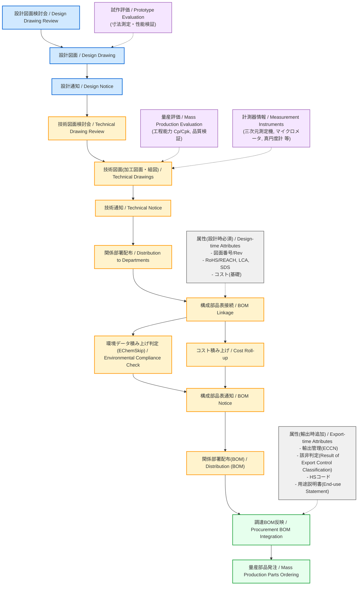

---

# 🏭 設計から量産部品発注までの一般的なフロー  
*General Workflow: From Design to Mass Production Parts Ordering*

> **注記｜Notice**  
> 本資料は、製造業において広く見られる一般的な実務フローを教育用に抽象化したものであり、特定企業の社内情報や機密情報は含みません。  
> *This material abstracts a workflow commonly observed in manufacturing industries for educational purposes. It does not contain any proprietary or internal company information.*

---

## 🔗 公式リンク | Official Links

| 言語 / Language | GitHub Pages 🌐 | GitHub 💻 |
|-----------------|----------------|-----------|
| 🇯🇵 Japanese |  |  |

---

## 📘 概要 | Overview
本資料は、設計段階から量産部品発注に至るまでの **一般的な製造業の実務プロセス** を体系的に整理したものです。  
*This document systematically organizes a general workflow in manufacturing industries, from design to mass-production parts ordering.*

「設計図面検討」「技術図面レビュー」「関係部署への通知と配布」「BOM（部品表）との連携」「量産部品の発注」といったステップを網羅します。  
*It covers steps such as design drawing reviews, technical drawing discussions, notices and distribution to related departments, BOM (Bill of Materials) linkage, and ordering of mass-production parts.*

---

## 🔁 実務ワークフロー | Practical Workflow

---

## 📂 プロセス説明 | Process Description

- **設計図面検討会 → 設計図面**  
  設計意図・仕様をレビューし、正式な設計図面を確定。  
  *Review design intent/specs and finalize the design drawing.*

- **設計通知 → 技術図面検討会**  
  設計図面を通知した上で、加工図面や組立図面に展開。  
  *Issue a design notice, then develop machining and assembly drawings.*

- **技術通知 → 関係部署配布**  
  加工・組立・品質保証・SCM部門に技術情報を共有。  
  *Distribute technical information to manufacturing, assembly, QA, and SCM.*

- **構成部品表接続 → 環境判定・コスト積上 → 構成部品表通知 → 部署配布**  
  BOMに反映し、適合性とコストを確認後、関係部署へ通知・配布。  
  *Link BOM, verify environmental compliance and cost roll-up, then notify and distribute to stakeholders.*

- **調達BOM反映 → 量産部品発注**  
  調達部門が量産用のBOMを基に、部品をサプライヤへ発注。  
  *Procurement updates the purchasing BOM and places orders for mass-production parts.*

- **（輸出が必要な場合）輸出関連属性の付与**  
  ECCN・該非判定・HSコード・用途説明書を付与。  
  *If export is required, add ECCN, export classification result, HS code, and end-use statement.*

---

## 🔗 関連教材リンク | Related Materials

本実務フローに関連して、**部品表（BOM）の生成**や**設計情報の構造化**を扱った教材も公開しています。  
In relation to this workflow, teaching materials on **BOM generation** and **structured design information** are also available.  

- [BOM生成と設計情報の構造化 / BOM Generation and Structured Design Information ›](https://samizo-aitl.github.io/EduMecha/08_production_process/06_bom_generation/)

---

## 👤 著作・ライセンス | Author & License
- ✍️ 著作 / Author: **三溝真一（Samizo-AITL）**  
  *Author: Shinichi Samizo (Samizo-AITL)*  
- 📜 ライセンス / License: **MIT（教育目的での使用・改変を歓迎）**  
  *MIT License (free use and modification for educational purposes).*

---

[🔝 トップに戻る / Back to top](../)

