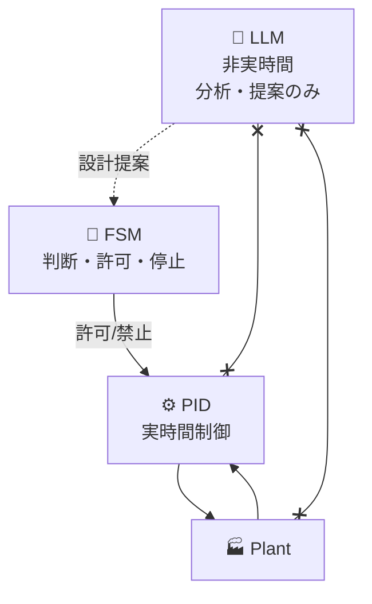

## 🎯 本記事の目的

本記事は、制御シリーズで確定した  
**AITL制御アーキテクチャの「設計仕様」だけ**をまとめます。

- 思想・背景説明：❌ 書かない  
- 価値判断・哲学：❌ 書かない  

👉 **「何がどこまでやるか」「何をやったら壊れるか」**  
を即座に確認できることを目的とします。

---

## 🧱 全体構成（確定）

### 🔁 レイヤ構造

---

## ⚙️ 各レイヤの責務一覧（表で確定）

### 📌 役割分担表

| レイヤ | 主な役割 | 実時間 | やってよいこと | やってはいけないこと |
|---|---|---|---|---|
| ⚙️ PID | 制御 | ✅ | 安定化、追従、V–I応答 | 判断、学習、最適化 |
| 🧾 FSM | 判断 | ✅ | 状態遷移、許可/停止 | 制御入力生成、推論 |
| 🔁 適応 | 補助 | ✅ | ゲイン微調整（条件付） | 常時動作、無制限補償 |
| 🧠 LLM | 分析 | ❌ | 原因分析、設計提案 | 実時間制御、安全判断 |

---

## ⚙️ PID層の仕様（確定）

### ✅ PIDがやること
- 実時間での安定制御  
- 設計条件内でのV–I応答  
- 決定論的な挙動  

### ❌ PIDがやらないこと（禁止）
- 状態判断  
- モード切替  
- ゲイン再設計  
- 学習・最適化  

👉 **PIDは「黙って安定させる」だけ**

---

## 🧾 FSM層の仕様（確定）

### ✅ FSMがやること
- 制御モード定義  
- 状態遷移管理  
- 適応の **許可 / 禁止**  
- 強制停止・フォールバック  

### ❌ FSMがやらないこと（禁止）
- 制御量計算  
- ゲイン算出  
- 学習・最適化  

👉 **FSMは「判断」専用**

---

## 🔁 適応制御（A-Type / B-Type）の扱い

### 📊 位置づけ比較

| 項目 | A-Type | B-Type |
|---|---|---|
| 目的 | 限界測定 | 運用 |
| 適応 | 常時ON | FSM許可制 |
| 信頼性 | ❌ 保証不可 | ✅ 下限維持 |
| 使用可否 | 実験のみ | 実運用可 |

---

## 🧠 LLM層の仕様（確定）

### ✅ LLMがやること
- 異常ログ解析  
- 劣化原因の言語化  
- 設計改善案の提示  

### ❌ LLMがやらないこと（厳禁）
- 実時間制御  
- 停止・復帰判断  
- Safety判定  

👉 **LLMは「考えるだけ」**

---

## 🚫 禁止設計一覧（重要）

以下を行った場合、**設計不良**とみなします。

- ❌ LLMを制御ループに入れる  
- ❌ FSMで最適化・学習を行う  
- ❌ 適応を常時ONにする  
- ❌ 停止条件を数値化しない  

---

## ✅ 本仕様の適用範囲

- 産業制御  
- ロボティクス  
- AI併用制御システム  

---

## 📌 仕様まとめ（最終）

- 制御：⚙️ PID  
- 判断：🧾 FSM  
- 適応：🔁 条件付き  
- 分析：🧠 LLM（非実時間）  

👉 **この責務分離を破らないこと。**

---

## 🔜 次回

**02. AI制御 安全設計チェックリスト**  
（Safety Envelope・停止・回復を図と表で整理）

