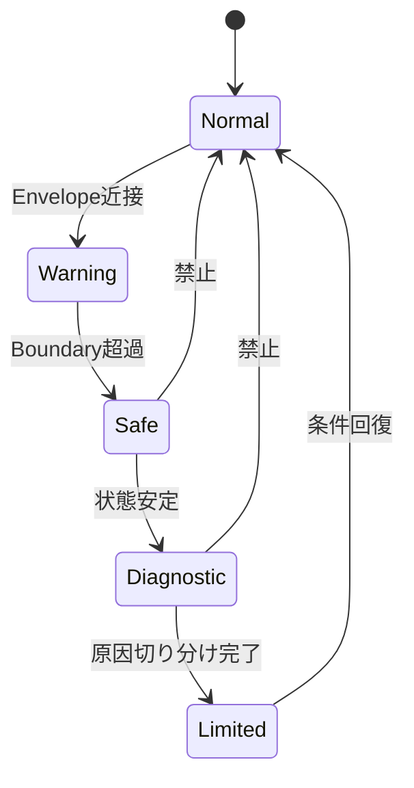

## 🎯 本記事の目的

本記事は、AI制御を**実運用に投入する前に必ず確認すべき安全設計項目**を  
**チェックリスト形式**で整理します。

- 思想・背景説明：❌  
- 技術ポエム：❌  

👉 **レビュー・安全審査・設計承認でそのまま使えること**を目的とします。

---

## 🧱 安全設計の全体像（必須3点）

AI制御が安全に成立するために、**以下3点が必須**です。

1. 🟦 **Safety Envelope（越えさせない）**  
2. 🟥 **Stop Logic（止める）**  
3. 🟩 **Recovery Control（安全に戻す）**

---

## 🗺️ 安全設計フロー（全体図）



---

## 🟦 1. Safety Envelope（必須）

### ✅ 定義必須項目チェック

| 項目 | 定義済み | 備考 |
|---|---|---|
| 監視状態量 | ⬜ | 位置 / 速度 / 電圧 / 電流 等 |
| 上限・下限 | ⬜ | ハードリミット |
| 変化率制限 | ⬜ | d/dt 制約 |
| 滞在時間制限 | ⬜ | タイムアウト |

---

### 📐 設計ルール（必須）

- ✅ 人間が設計する  
- ✅ 固定値として扱う  
- ❌ AI・学習で更新しない  

👉 **Safety Envelopeは「学習対象にしない」**

---

## 🟥 2. Stop Logic（必須）

### 🔍 判断指標（例）

| 指標 | 内容 |
|---|---|
| Δt / Δt₀ | 応答時間比 |
| Kp / Kp₀ | ゲイン補償率 |
| A / A₀ | 振幅比 |

---

### ⚙️ 判定ロジック（例）

```text
if 指標 > 閾値:
    ADAPT_STOP
```

### ✅ 要件

- 決定論的  
- 数値で説明可能  
- ログ追跡可能  

---

## 🧯 3. Recovery Control（必須）

### 🧩 必須モード一覧

| モード | 役割 |
|---|---|
| Safe | 出力最小・確実動作 |
| Diagnostic | 原因切り分け |
| Limited | 制限付き復帰 |
| Normal | 通常運転 |

---

### 🚫 禁止遷移（重要）

- ❌ Safe → Normal  
- ❌ Diagnostic → Normal  
- ❌ AI判断による復帰  

👉 **必ず段階復帰**とします。

---

## 🧠 LLMの使用制限（安全要件）

### ✅ 許可

- 異常原因の分析  
- ログ要約  
- 設計改善案提示  

### ❌ 禁止

- 安全判定  
- 停止判断  
- 復帰判断  

---

## 🚫 NG設計一覧（即不合格）

- ❌ Safety Envelopeを学習させる  
- ❌ Stopを警告扱いにする  
- ❌ 自動即時復帰  
- ❌ 境界値をログに残さない  

---

## ✅ 合格条件（最終チェック）

以下3点が**すべてYES**であることが必須です。

- ☑ 越えさせない（Envelope）  
- ☑ 止められる（Stop Logic）  
- ☑ 安全に戻れる（Recovery）  

---

## 📌 まとめ（仕様確定）

- 安全境界：🟦 Safety Envelope  
- 停止判断：🟥 FSM（決定論）  
- 回復設計：🟩 段階復帰  

👉 **この3点が欠けたAI制御は運用不可です。**

---

## 🔜 次回

**03. 適応制御の適用限界整理**  
（A-Type / B-Type 検証結果を数値と図でまとめます）

